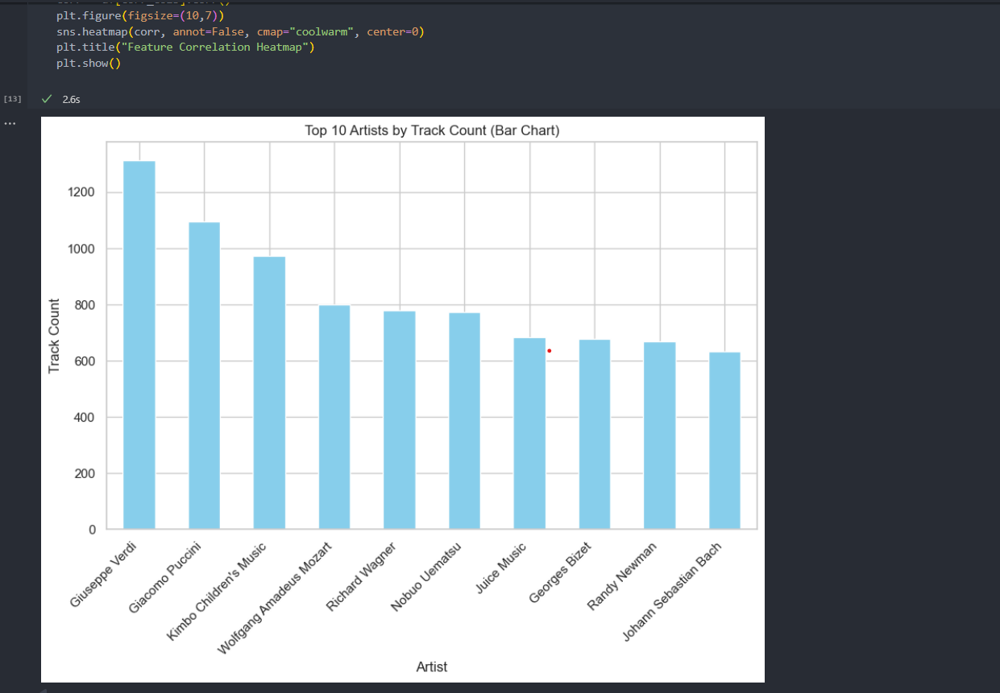
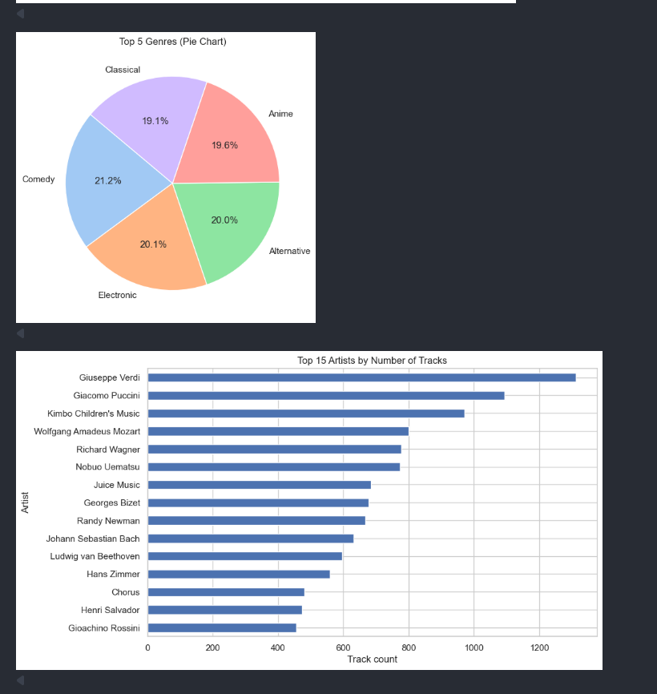
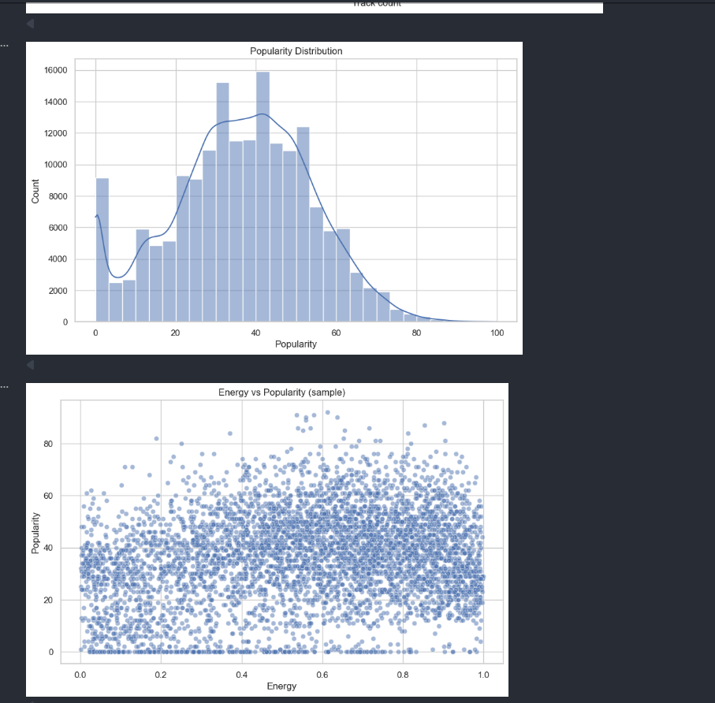
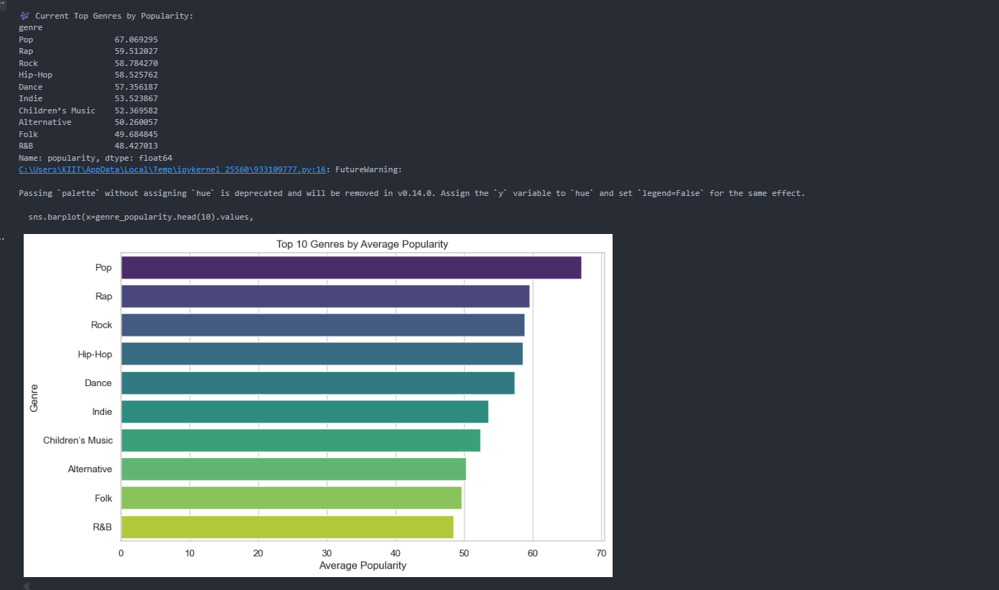
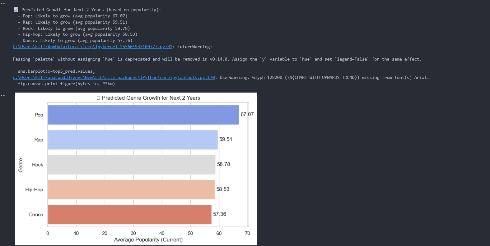
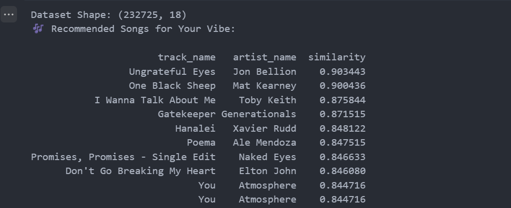
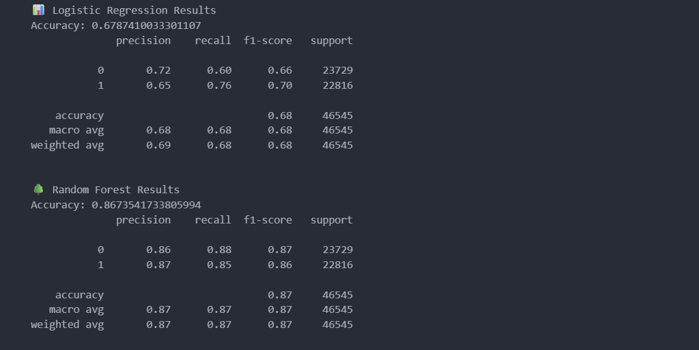
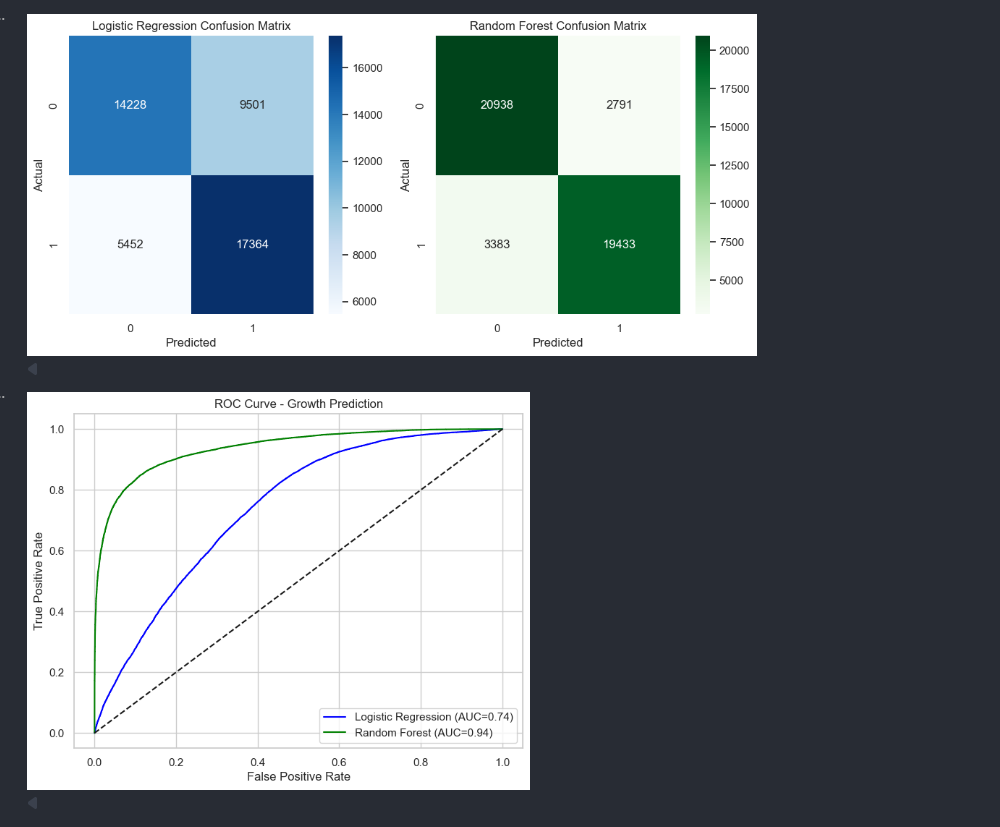

# 🎵 Music Genre Analysis & Recommendation

## 📌 Project Overview
This project investigates a **music dataset** to identify trends across various genres and their unique characteristics.  
It also implements a **basic recommendation mechanism** that suggests similar tracks by comparing extracted features.

## 🚀 Key Highlights
- Downloaded and preprocessed the dataset directly in the workflow.  
- Visualized the distribution of different music genres.  
- Extracted statistical and audio-related features for deeper understanding.  
- Built a simple recommendation system using feature similarity.  
- Generated visual insights such as genre distribution, feature correlations, and prediction results.  

## 📊 Visual Outputs
Example results from the analysis (screenshots available in `images/` folder):

### 🎶 Genre Distribution
  
  
  

### 🔗 Feature Correlation Heatmap
  

### 🎯 Prediction Results
  
  

### 🎧 Recommendation Output
  

### 📈 Accuracy & Performance
  
  

## 🔮 Future Enhancements
- Integrate advanced recommendation methods (collaborative filtering, deep learning).  
- Add user-driven inputs for customized suggestions.  
- Deploy as an interactive web app for wider accessibility.  

## 👨‍💻 Author
**Sambeet Panda**
